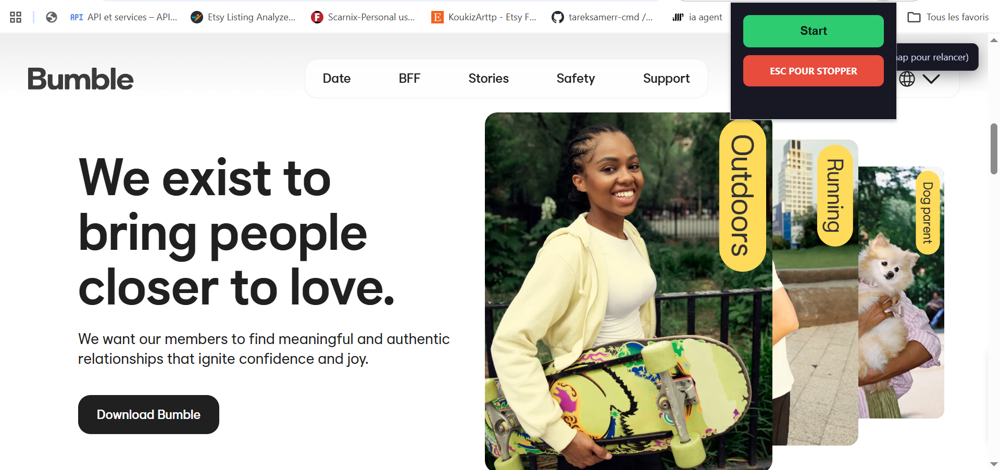
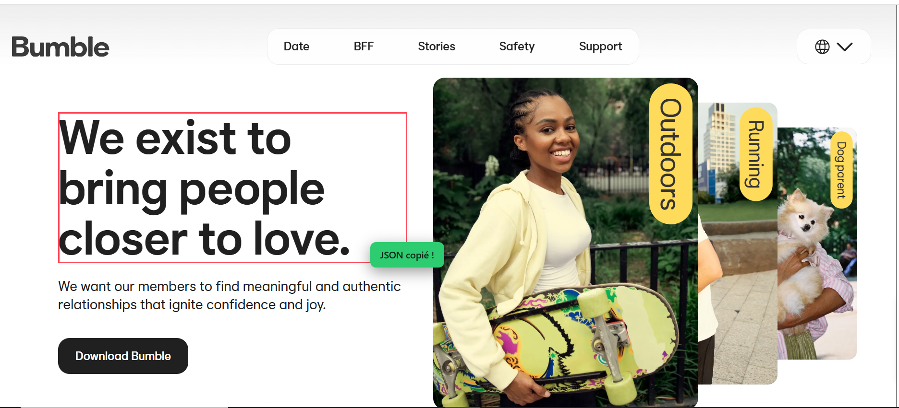

# Cursor Inspector

<video src="position-extension.mp4" controls width="100%"></video>





Chrome extension that detects the exact element under the cursor, captures its position and the cursor's position, and copies this data as JSON in one click.

## Benefits for AI agents

The copied JSON is designed to be given directly to an AI assistant. It contains **4 independent signals** so the AI can identify the element exactly, even on dynamic pages, in shadow DOM, or inside iframes:

- **`selectors`**: unique and verified CSS selector (short + full path) and absolute XPath, with a confidence score
- **`element`**: rich fingerprint — tag, id, classes, all attributes, text content, ARIA role, form fields
- **`dom`**: DOM context — depth, index among siblings, ancestor chain, shadow DOM path, iframe path
- **`visual`**: visual signature — bounding rect, computed styles (display, position, colors, font), cursor position

If one signal fails (e.g. a selector breaks on a dynamic page), the AI can cross-check with the others.

<span style="color:red; font-weight:800;">Example of a dialogue with an AI agent:</span>

> **User**: `{ "selector": "body > div:nth-of-type(1) > button:nth-of-type(2)", "cursor": { "x": 214, "y": 219 }, "element": { "top": 192, "left": 155, "width": 85, "height": 35 } }` <span style="color:red; font-weight:800;">place this element to the right</span>
>
> **AI agent**: `document.querySelector('body > div:nth-of-type(1) > button:nth-of-type(2)').style.marginLeft = '200px';`

## Test pages

- `test.html`: simple page with nested elements (buttons, cards, duplicated elements)

## Features

- **Hover**: the element under the cursor is outlined in red
- **Click or Enter**: a short ID (e.g. `ci-20260916-214530-a3f2`) is copied to the clipboard, the full JSON is saved to `~/Downloads/cursor-inspector/<id>.json`, with a confirmation toast
- **Esc**: stops or restarts the extension
- **Popup**: green Start button to start detection

## Installation

1. Open Chrome and go to `chrome://extensions`
2. Enable **developer mode** (top right corner)
3. Click **Load unpacked**
4. Select the `cursor-inspector-extension` folder
5. The "Cursor Inspector" extension appears

## Usage

1. Open a page (e.g.: `test.html` or `coiffeur.html`)
2. Click on the extension icon in the toolbar
3. Click the green **Start** button
4. Hover over elements: the red outline follows the cursor
5. Click on an element (or press **Enter**): a short ID is copied, the full JSON is saved to `~/Downloads/cursor-inspector/<id>.json`, a toast confirms it
6. Paste the ID into an AI agent (e.g. opencode) and tell it once where the files live:

> **User**: `ci-20260916-214530-a3f2` — the element data is in `~/Downloads/cursor-inspector/ci-20260916-214530-a3f2.json`
>
> **AI agent**: reads the file and identifies the element exactly.

The saved JSON looks like this:

```json
{
  "selectors": {
    "css": "body > div.card:nth-of-type(1) > button.btn:nth-of-type(2)",
    "cssShort": "#btn-submit",
    "xpath": "/html/body/div[1]/button[2]",
    "unique": true,
    "confidence": 0.95
  },
  "element": {
    "tag": "button",
    "id": "btn-submit",
    "classes": ["btn"],
    "attributes": { "type": "submit", "name": "submit", "data-action": "save" },
    "text": "Enregistrer",
    "role": "button",
    "ariaLabel": "Enregistrer les modifications",
    "name": "submit",
    "href": null, "src": null, "placeholder": null,
    "value": null, "alt": null, "title": null
  },
  "dom": {
    "depth": 4,
    "index": 1,
    "siblings": 3,
    "ancestors": [
      { "tag": "body", "id": null, "classes": [] },
      { "tag": "div", "id": null, "classes": ["card"] },
      { "tag": "form", "id": null, "classes": [] }
    ],
    "shadow": { "inShadowRoot": false, "hostSelector": null },
    "frame": { "isTop": true, "selector": null }
  },
  "visual": {
    "rect": { "top": 192, "left": 155, "width": 85, "height": 35 },
    "display": "inline-block", "visibility": "visible", "position": "static",
    "zIndex": "auto", "color": "rgb(255,255,255)",
    "backgroundColor": "rgb(46,204,113)", "fontSize": "14px",
    "fontFamily": "Arial, sans-serif",
    "cursor": { "x": 214, "y": 219 }
  }
}
```

7. Press **Esc** to stop the extension, **Esc** again to restart it


## Project structure

```
cursor-inspector-extension/
├── manifest.json      → Manifest V3, content_scripts on all pages + iframes
├── inspector-core.js  → pure functions: selectors, fingerprint, DOM context, visual signature
├── content.js         → event wiring, highlighting, ID copy
├── background.js      → service worker: saves the JSON to Downloads (silently)
├── styles.css         → styles for the highlight, the toast, the hint and the badge
├── popup.html         → popup interface (Start button)
├── popup.js           → sends the Start message to the content script
├── test.html          → test page (shadow DOM, iframe, duplicates, rich attributes)
├── test/              → Node tests (jsdom)
└── package.json       → npm test (jsdom devDependency)
```

## Notes

- No build, no runtime dependency, Vanilla JavaScript (jsdom is only a devDependency for tests)
- Run tests: `npm install` then `npm test`
- The full JSON is saved to `~/Downloads/cursor-inspector/<id>.json`; the clipboard only receives the short ID, so pasting into an AI agent does not flood its context
- Downloads are silent: the extension hides Chrome's download UI (`chrome.downloads.setUiOptions`). Note this hides the download UI for **all** downloads while the extension is enabled
- If saving fails, the extension falls back to copying the full JSON